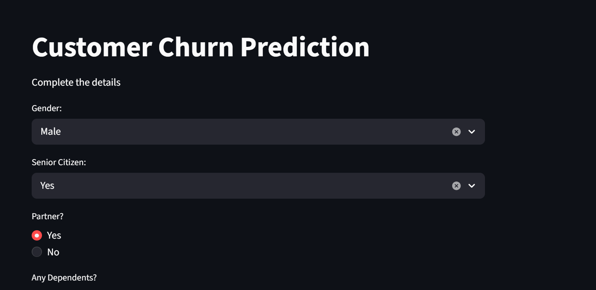
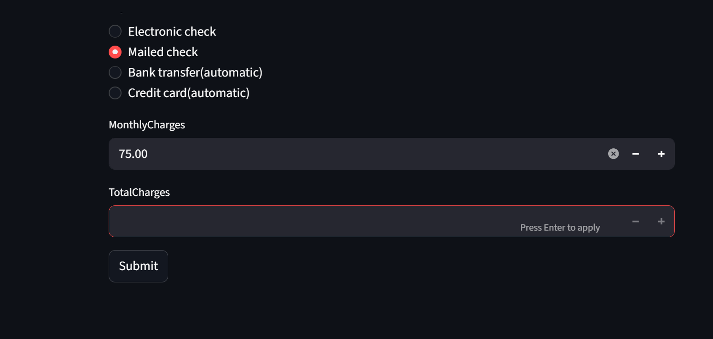
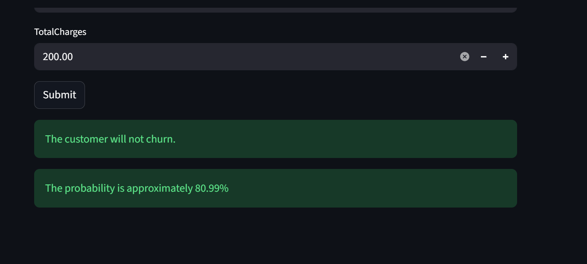

# Customer-Churn-Prediction

What does customer churn mean?

Customer churn is the number of existing customers who leaves or unsubscribes or stop doing buisness with a company.Customer churn can also be refered as customer loss , customer turnover or customer defection.

Importance of predicting the customer churn for give data.

Knowing about which customer is more likely to leave or churn a company (like telecom company) is beneficial because it significantly affects the company's bottom line as aquaring an new customer is more expensive than retaining the old one. Losing customers results in immediate drop in recurring revenue in a company which leads its sales and marketing team to work twice as hard to main the flat growth rate.

High churn rates also signal underlying issues with product-market fit and customer support quality.
# Customer-Churn-Prediction
<div align="center">

# 📊 Customer Churn Prediction

### Machine Learning | Classification | Streamlit

Predicting customer churn using various information.

<br>


</div>

## What does customer churn mean?

Customer churn is the number of existing customers who leaves or unsubscribes or stop doing buisness with a company.Customer churn can also be refered as customer loss , customer turnover or customer defection.

## Importance of predicting the customer churn for give data.

Knowing about which customer is more likely to leave or churn a company (like telecom company) is beneficial because it significantly affects the company's bottom line as aquaring an new customer is more expensive than retaining the old one. Losing customers results in immediate drop in recurring revenue in a company which leads its sales and marketing team to work twice as hard to main the flat growth rate.

High churn rates also signal underlying issues with product-market fit and customer support quality.

## The project follows a complete end-to-end machine learning workflow:

```text
📥 Data Collection
      ↓
🧹 Data Cleaning
      ↓
🔎 Exploratory Data Analysis
      ↓
⚙️ Data Preprocessing
      ↓
🤖 Model Training
      ↓
📊 Model Evaluation
      ↓
🏆 Model Selection
      ↓
💾 Model Serialization
      ↓
🚀 Streamlit Deployment
```

---

## 🎯 Project Objective

Build a reliable classification model that can:

- Predict whether a customer is likely to churn
- Estimate the probability of churn
- Compare different classification algorithms
- Evaluate model performance using multiple metrics
- Deploy the final model through an interactive web application

## Dataset

The dataset contains **7,043 customers** with **21 initial features**.
It is available on kaggle.
LINK- https://www.kaggle.com/datasets/blastchar/telco-customer-churn

## 📊 Exploratory Data Analysis & Data Cleaning

- Performed **univariate, bivariate, and churn distribution analysis**.
- Converted `TotalCharges` to numeric and handled missing values.
- Removed `customerID` and identified **22 duplicate records**.
- Analyzed categorical/numerical distributions, skewness, and correlations.
- Converted `SeniorCitizen` to categorical type for analysis.
- Explored customer characteristics and key patterns associated with churn.

## ⚙️ Data Preprocessing
Different preprocessing techniques were applied based on the type of feature.

| Feature Type | Technique |
|--------------|-----------|
| 🎯 Target | Label Encoding |
| 📑 Contract | Ordinal Encoding |
| 🔤 Categorical Features | One-Hot Encoding |
| 🔢 Numerical Features | Standard Scaling |

A `ColumnTransformer` was used to apply the appropriate transformation to each group of features, followed by a Scikit-learn `Pipeline` for model training.

The dataset was split into:

- **80% Training Data**
- **20% Testing Data**

---

## 🤖 Machine Learning Models 
1. Logistic Regression
2. Decision Tree Classifier

### Performance

| Model | Accuracy | Precision | Recall | F1-Score | ROC-AUC |
|-------|----------|-----------|--------|----------|---------|
| 🥇 **Logistic Regression** | **80.77%** | **67.47%** | **57.88%** | **62.31%** | **84.90%** |
| Decision Tree | 74.10% | 52.91% | 51.68% | 52.29% | 67.14% |

5-fold cross-validation was also performed:

| Model | Cross-Validation Accuracy |
|-------|----------------------------|
| **Logistic Regression** | **80.17%** |
| Decision Tree | 71.87% |

**Logistic Regression achieved better performance across the evaluated metrics and was therefore selected as the final model.**

#### ROC-AUC was used to evaluate how effectively the models distinguish between customers who churn and those who do not.

```text
Logistic Regression     █████████████████  0.849
Decision Tree           █████████████      0.671
```

####### 🏆 Final Model

**Logistic Regression — ROC-AUC: 0.849**

Based on the evaluation results, Logistic Regression was selected as the final model.

---

## 💾 Model Serialization & Deployment

The trained model was saved using `pickle` as `pipe.pkl`, which contains the complete preprocessing and prediction pipeline.

The model was then deployed using **Streamlit**, where users can enter customer details such as demographics, tenure, services, contract type, payment method, and charges.

The application provides:
- **Churn Prediction**
- **Churn Probability**

## 🖥️ Application Screenshots




## 🚀 How to Run
```bash
pip install -r requirements.txt
streamlit run app.py
```

## 🛠️ Tech Stack
- 🐍 Python
- 🐼 Pandas & NumPy
- 📊 Matplotlib & Seaborn
- 🤖 Scikit-learn
- 🌐 Streamlit
- 💾 Pickle

## 📁 Project Structure
```text
Customer-Churn-Prediction/
│
├── data/
│   └── customer.csv
├── notebooks/
│   ├── eda.ipynb
│   └── model_training.ipynb
├── screenshots/
│   ├── home.png
│   └── prediction.png
├── app.py
├── pipe.pkl
├── requirements.txt
└── README.md
```